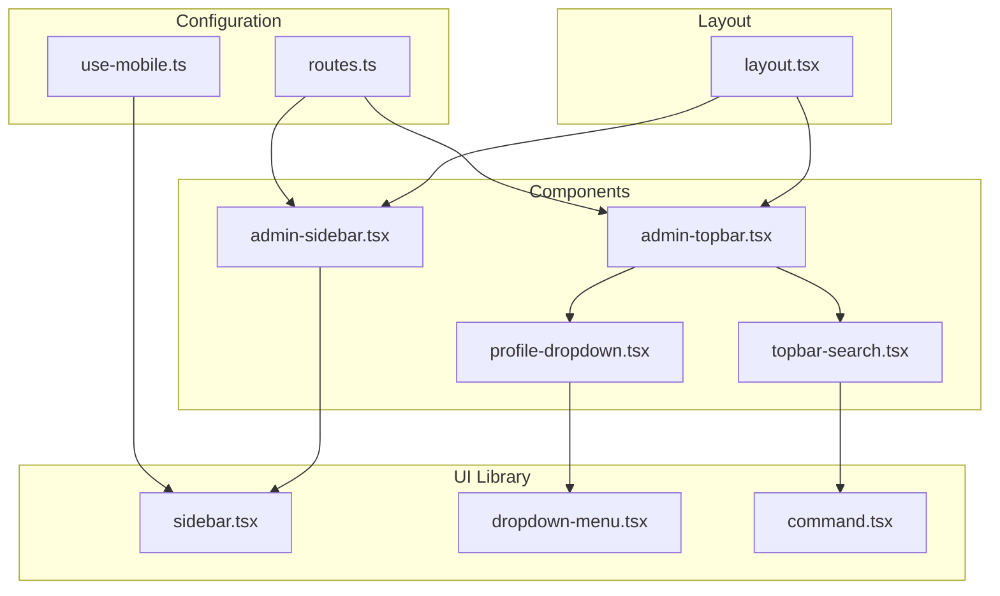
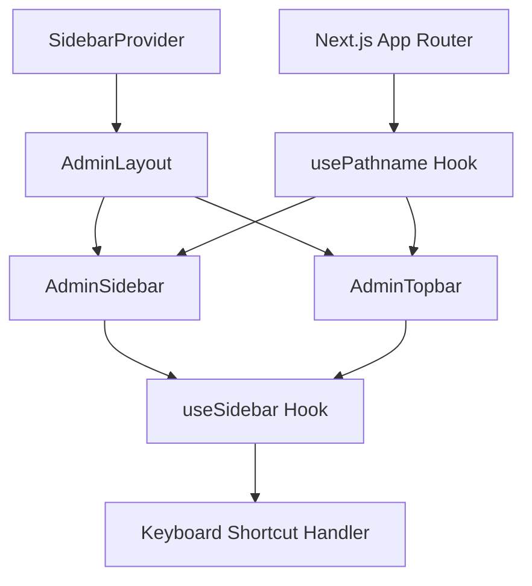
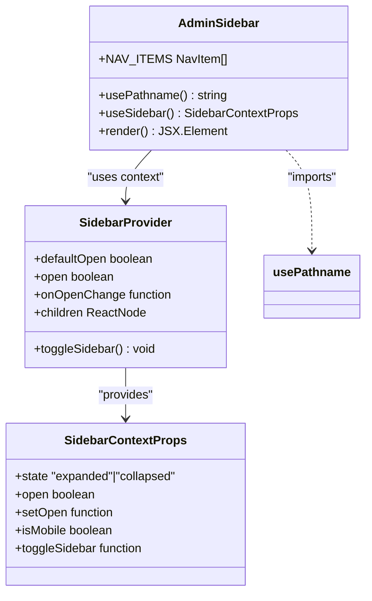
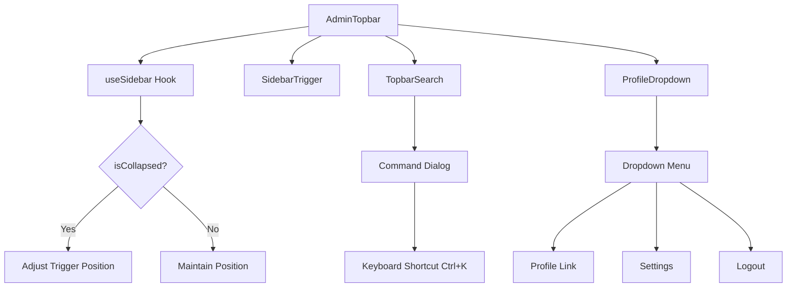
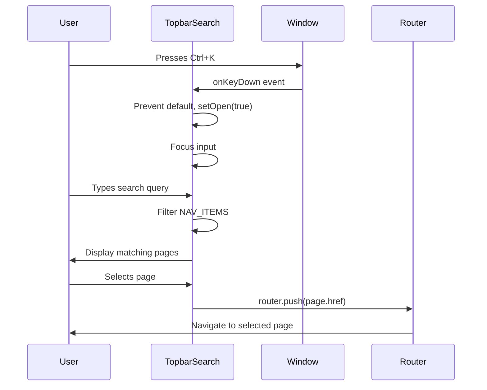
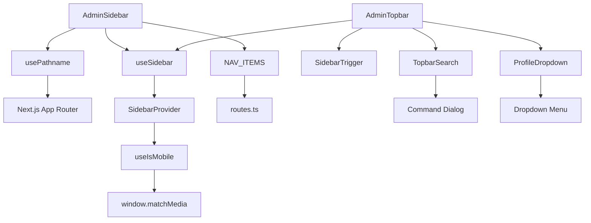

# Navigation Components

<cite>
**Referenced Files in This Document**   
- [admin-sidebar.tsx](file://src/components/admin/layout/admin-sidebar.tsx)
- [admin-topbar.tsx](file://src/components/admin/layout/admin-topbar.tsx)
- [layout.tsx](file://src/app/(admin)/layout.tsx)
- [topbar-search.tsx](file://src/components/admin/layout/topbar-search.tsx)
- [profile-dropdown.tsx](file://src/components/admin/layout/profile-dropdown.tsx)
- [sidebar.tsx](file://src/components/ui/sidebar.tsx)
- [routes.ts](file://src/constants/routes.ts)
- [use-mobile.ts](file://src/hooks/use-mobile.ts)
</cite>

## Table of Contents
1. [Introduction](#introduction)
2. [Project Structure](#project-structure)
3. [Core Components](#core-components)
4. [Architecture Overview](#architecture-overview)
5. [Detailed Component Analysis](#detailed-component-analysis)
6. [Dependency Analysis](#dependency-analysis)
7. [Performance Considerations](#performance-considerations)
8. [Troubleshooting Guide](#troubleshooting-guide)
9. [Conclusion](#conclusion)

## Introduction
This document provides comprehensive documentation for the navigation components used in the admin dashboard of the Cartwright King ERP system. It covers sidebar navigation, top-level menus, breadcrumbs, tabbed interfaces, pagination controls, command palettes, and menubars. The implementation leverages Next.js App Router for URL synchronization and state management, with a focus on accessibility, theming, and mobile responsiveness.

## Project Structure
The navigation system is organized across multiple directories with a clear separation of concerns. The core navigation components reside in the `src/components/admin/layout` directory, while reusable UI primitives are located in `src/components/ui`. The App Router structure under `src/app/(admin)` defines the routing hierarchy and layout composition.

**Diagram sources**
- [admin-sidebar.tsx](file://src/components/admin/layout/admin-sidebar.tsx)
- [admin-topbar.tsx](file://src/components/admin/layout/admin-topbar.tsx)
- [layout.tsx](file://src/app/(admin)/layout.tsx)
- [sidebar.tsx](file://src/components/ui/sidebar.tsx)

**Section sources**
- [admin-sidebar.tsx](file://src/components/admin/layout/admin-sidebar.tsx)
- [admin-topbar.tsx](file://src/components/admin/layout/admin-topbar.tsx)
- [layout.tsx](file://src/app/(admin)/layout.tsx)

## Core Components
The navigation system consists of several key components that work together to provide a cohesive user experience. The `AdminSidebar` provides primary navigation with collapsible functionality, while the `AdminTopbar` contains secondary navigation elements including search and user profile. These components are integrated through the `AdminLayout` which manages state and context providers.

**Section sources**
- [admin-sidebar.tsx](file://src/components/admin/layout/admin-sidebar.tsx#L40-L122)
- [admin-topbar.tsx](file://src/components/admin/layout/admin-topbar.tsx#L5-L20)
- [layout.tsx](file://src/app/(admin)/layout.tsx#L24-L49)

## Architecture Overview
The navigation architecture follows a provider-consumer pattern using React Context for state management. The `SidebarProvider` manages the expanded/collapsed state of the sidebar and handles keyboard shortcuts, while individual components consume this state through the `useSidebar` hook. URL synchronization is handled automatically by Next.js App Router through the `usePathname` hook.

**Diagram sources**
- [layout.tsx](file://src/app/(admin)/layout.tsx#L24-L49)
- [sidebar.tsx](file://src/components/ui/sidebar.tsx#L55-L151)
- [admin-sidebar.tsx](file://src/components/admin/layout/admin-sidebar.tsx#L40-L122)

## Detailed Component Analysis

### Sidebar Navigation Analysis
The `AdminSidebar` component provides the primary navigation interface with support for collapsible states and active item highlighting. It uses data attributes and CSS variables to manage visual states and leverages the `usePathname` hook to determine active routes.

**Diagram sources**
- [admin-sidebar.tsx](file://src/components/admin/layout/admin-sidebar.tsx#L40-L122)
- [sidebar.tsx](file://src/components/ui/sidebar.tsx#L55-L151)

**Section sources**
- [admin-sidebar.tsx](file://src/components/admin/layout/admin-sidebar.tsx#L40-L122)
- [routes.ts](file://src/constants/routes.ts#L5-L27)

### Topbar Navigation Analysis
The `AdminTopbar` component contains secondary navigation elements including the sidebar toggle, search functionality, and user profile dropdown. It responds to the sidebar state and provides a consistent interface across all admin pages.

**Diagram sources**
- [admin-topbar.tsx](file://src/components/admin/layout/admin-topbar.tsx#L5-L20)
- [topbar-search.tsx](file://src/components/admin/layout/topbar-search.tsx#L10-L132)
- [profile-dropdown.tsx](file://src/components/admin/layout/profile-dropdown.tsx#L22-L70)

**Section sources**
- [admin-topbar.tsx](file://src/components/admin/layout/admin-topbar.tsx#L5-L20)
- [topbar-search.tsx](file://src/components/admin/layout/topbar-search.tsx#L10-L132)
- [profile-dropdown.tsx](file://src/components/admin/layout/profile-dropdown.tsx#L22-L70)

### Command Palette Implementation
The command palette provides a keyboard-driven navigation interface that allows users to quickly search and navigate to different pages. It is triggered by the Ctrl+K (or Cmd+K on Mac) keyboard shortcut and displays a searchable list of available pages.

**Diagram sources**
- [topbar-search.tsx](file://src/components/admin/layout/topbar-search.tsx#L10-L132)
- [routes.ts](file://src/constants/routes.ts#L5-L27)

**Section sources**
- [topbar-search.tsx](file://src/components/admin/layout/topbar-search.tsx#L10-L132)

## Dependency Analysis
The navigation components have well-defined dependencies that follow the principle of separation of concerns. The core dependencies include React hooks for state management, Next.js routing utilities, and UI component libraries for consistent styling.

**Diagram sources**
- [admin-sidebar.tsx](file://src/components/admin/layout/admin-sidebar.tsx)
- [admin-topbar.tsx](file://src/components/admin/layout/admin-topbar.tsx)
- [sidebar.tsx](file://src/components/ui/sidebar.tsx)
- [use-mobile.ts](file://src/hooks/use-mobile.ts)

**Section sources**
- [admin-sidebar.tsx](file://src/components/admin/layout/admin-sidebar.tsx)
- [admin-topbar.tsx](file://src/components/admin/layout/admin-topbar.tsx)
- [sidebar.tsx](file://src/components/ui/sidebar.tsx)
- [use-mobile.ts](file://src/hooks/use-mobile.ts)

## Performance Considerations
The navigation components are optimized for performance through several mechanisms:
- Memoization of context values using `useMemo`
- Efficient event handling with useCallback
- Conditional rendering based on screen size
- Lazy loading of non-essential components
- Minimal re-renders through proper state management

The sidebar state is persisted to cookies to maintain user preferences across sessions, reducing the need for client-side state initialization on subsequent visits.

## Troubleshooting Guide
Common issues with navigation components and their solutions:

**Menu Clipping Issues**
- Ensure proper z-index values are set for overlapping elements
- Verify that parent containers don't have overflow:hidden properties
- Check for conflicting CSS rules from global styles

**Z-Index Conflicts**
- Use consistent z-index scale (e.g., 10, 20, 30) rather than arbitrary values
- Ensure modal/dialog components have higher z-index than navigation elements
- Use CSS custom properties for z-index management

**Mobile Responsiveness Problems**
- Verify that `useIsMobile` hook is properly detecting screen size
- Check that media queries are correctly defined in CSS
- Ensure touch targets are at least 44px for mobile devices

**Accessibility Issues**
- Confirm all interactive elements have proper aria-labels
- Ensure keyboard navigation works with Tab and Arrow keys
- Verify screen reader announcements for state changes

**Section sources**
- [sidebar.tsx](file://src/components/ui/sidebar.tsx)
- [use-mobile.ts](file://src/hooks/use-mobile.ts)

## Conclusion
The navigation components in the Cartwright King admin dashboard provide a robust, accessible, and user-friendly interface for moving through the application. By leveraging Next.js App Router, React Context, and well-structured component architecture, the system maintains active state and URL synchronization while supporting keyboard navigation, focus management, and mobile responsiveness. The theming system through Tailwind classes allows for easy customization, and the accessibility features ensure compliance with screen reader requirements.