# UI Components

<cite>
**Referenced Files in This Document**   
- [button.tsx](file://src/components/ui/button.tsx)
- [card.tsx](file://src/components/ui/card.tsx)
- [table.tsx](file://src/components/ui/table.tsx)
- [app-modal.tsx](file://src/components/common/app-modal.tsx)
- [profile-dropdown.tsx](file://src/components/admin/layout/profile-dropdown.tsx)
- [card-table.tsx](file://src/components/card-table/card-table.tsx)
- [form.tsx](file://src/components/ui/form.tsx)
- [globals.css](file://src/app/globals.css)
</cite>

## Table of Contents
1. [Introduction](#introduction)
2. [Core UI Components](#core-ui-components)
3. [Reusable Component Library](#reusable-component-library)
4. [Form Integration and Validation](#form-integration-and-validation)
5. [Responsive Design and Accessibility](#responsive-design-and-accessibility)
6. [Styling and Theming System](#styling-and-theming-system)
7. [Performance and Cross-Browser Compatibility](#performance-and-cross-browser-compatibility)
8. [Component Usage Examples](#component-usage-examples)
9. [Conclusion](#conclusion)

## Introduction
This document provides comprehensive documentation for the UI component library used throughout the CartwrightKing Admin ERP application. The library is built on top of shadcn/ui primitives and enhanced with Tailwind CSS for styling, providing a consistent, accessible, and reusable set of components across the admin dashboard. The components follow modern React patterns with full TypeScript support, ensuring type safety and developer experience. This documentation covers visual appearance, behavior, user interaction patterns, props/attributes, events, customization options, and integration patterns for key components including buttons, cards, tables, modals, and forms.

## Core UI Components

### Button Component
The Button component is a versatile and accessible UI element that supports multiple variants and sizes. It is built using the class-variance-authority (CVA) pattern for consistent styling across different states and use cases.

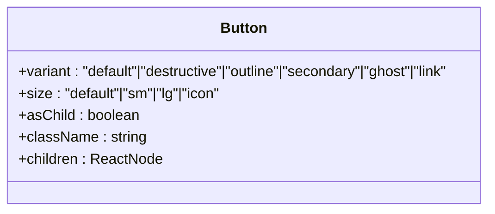

**Diagram sources**  
- [button.tsx](file://src/components/ui/button.tsx#L1-L59)

**Section sources**  
- [button.tsx](file://src/components/ui/button.tsx#L1-L59)

### Card Component
The Card component provides a structured container for grouping related content with a consistent visual hierarchy. It includes dedicated slots for header, title, description, content, action, and footer elements.

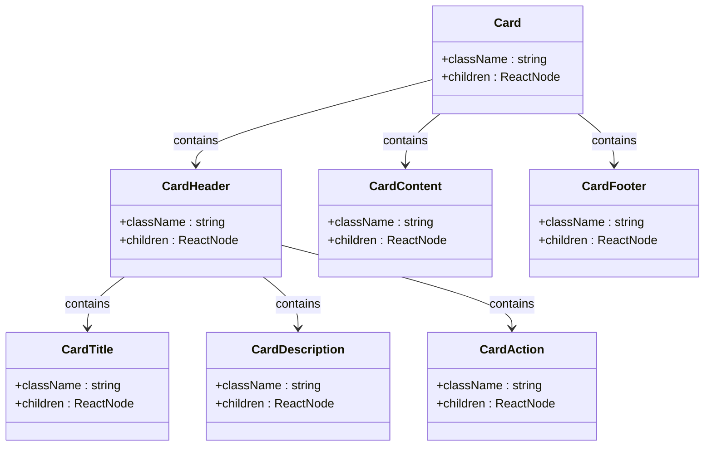

**Diagram sources**  
- [card.tsx](file://src/components/ui/card.tsx#L1-L92)

**Section sources**  
- [card.tsx](file://src/components/ui/card.tsx#L1-L92)

### Table Component
The Table component provides a responsive and accessible data display system with proper semantic HTML structure. It includes components for header, body, footer, rows, and cells with consistent styling.

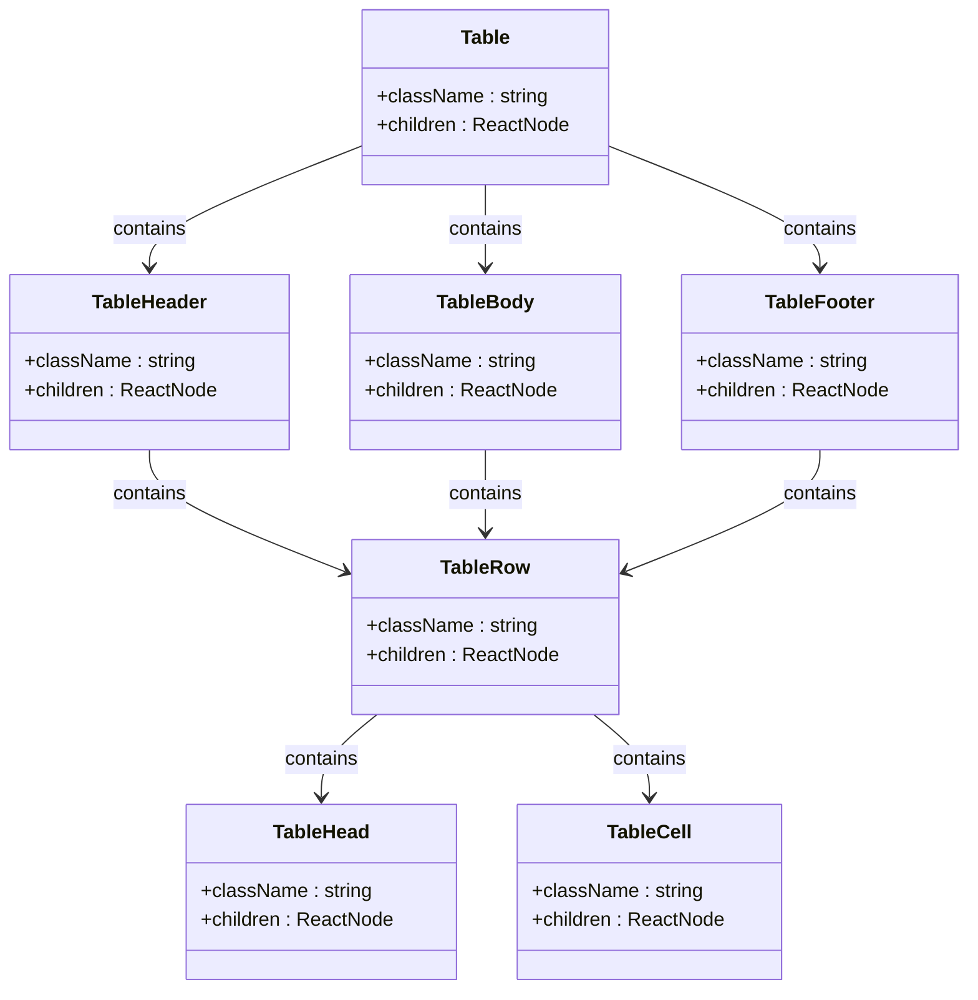

**Diagram sources**  
- [table.tsx](file://src/components/ui/table.tsx#L1-L113)

**Section sources**  
- [table.tsx](file://src/components/ui/table.tsx#L1-L113)

## Reusable Component Library

### AppModal Component
The AppModal component provides a consistent modal dialog experience throughout the application with configurable header, content, footer, and actions. It wraps the shadcn/ui Dialog component with additional business logic and styling.

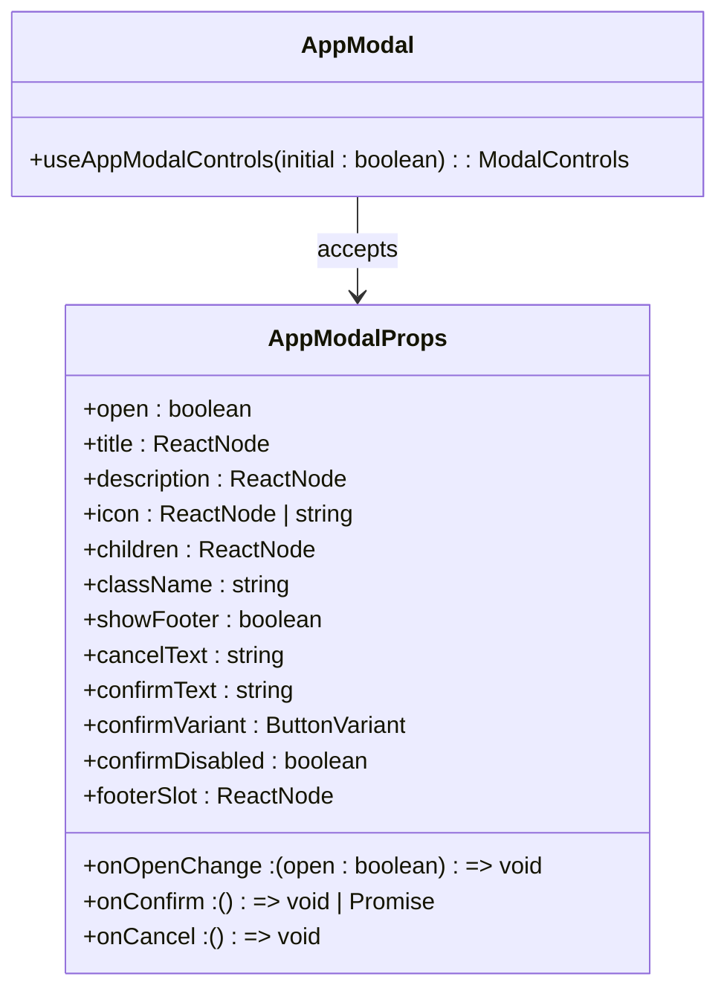

**Diagram sources**  
- [app-modal.tsx](file://src/components/common/app-modal.tsx#L1-L116)

**Section sources**  
- [app-modal.tsx](file://src/components/common/app-modal.tsx#L1-L116)

### ProfileDropdown Component
The ProfileDropdown component displays the current user's profile information with a dropdown menu for account actions including profile access, settings, and logout functionality.

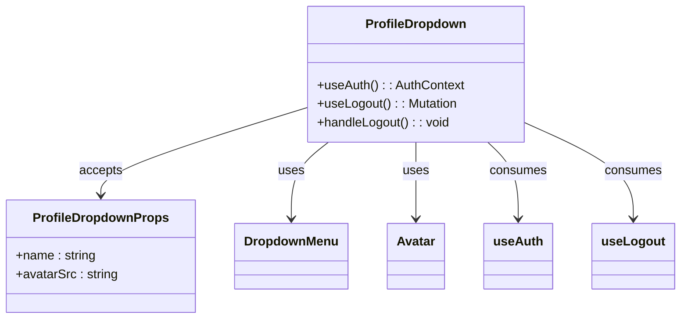

**Diagram sources**  
- [profile-dropdown.tsx](file://src/components/admin/layout/profile-dropdown.tsx#L1-L73)

**Section sources**  
- [profile-dropdown.tsx](file://src/components/admin/layout/profile-dropdown.tsx#L1-L73)

### CardTable Component
The CardTable component is a specialized data table implementation that displays information in a card-like format optimized for mobile and desktop views. It integrates with TanStack React Table for advanced data handling capabilities.

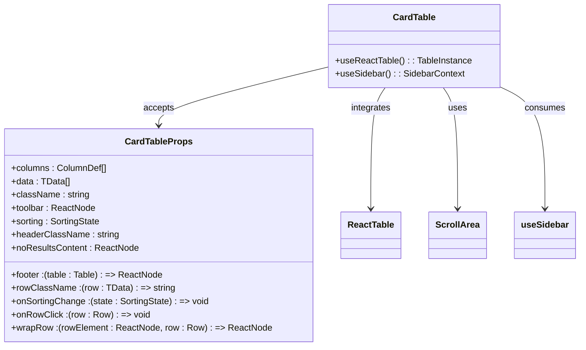

**Diagram sources**  
- [card-table.tsx](file://src/components/card-table/card-table.tsx#L1-L142)

**Section sources**  
- [card-table.tsx](file://src/components/card-table/card-table.tsx#L1-L142)

## Form Integration and Validation

### Form Component Integration
The form system integrates React Hook Form with shadcn/ui components to provide a seamless form handling experience with proper validation, error states, and accessibility features.

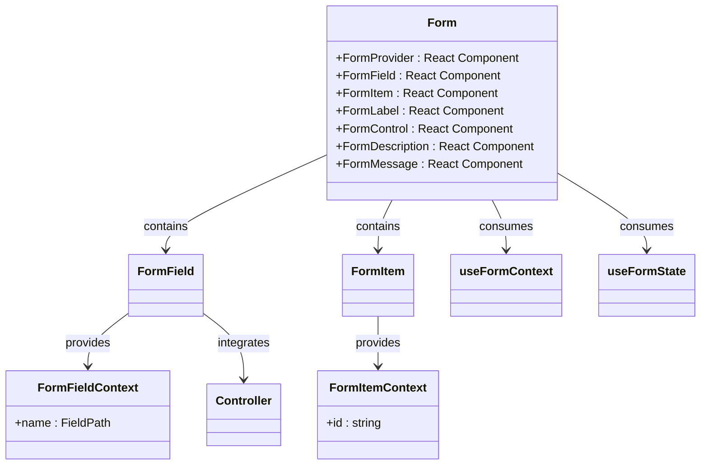

**Diagram sources**  
- [form.tsx](file://src/components/ui/form.tsx#L1-L55)

**Section sources**  
- [form.tsx](file://src/components/ui/form.tsx#L1-L55)

## Responsive Design and Accessibility

### Responsive Behavior
The UI components are designed with responsive behavior in mind, adapting to different screen sizes through conditional rendering and layout adjustments. The useSidebar hook provides mobile detection that influences component rendering.

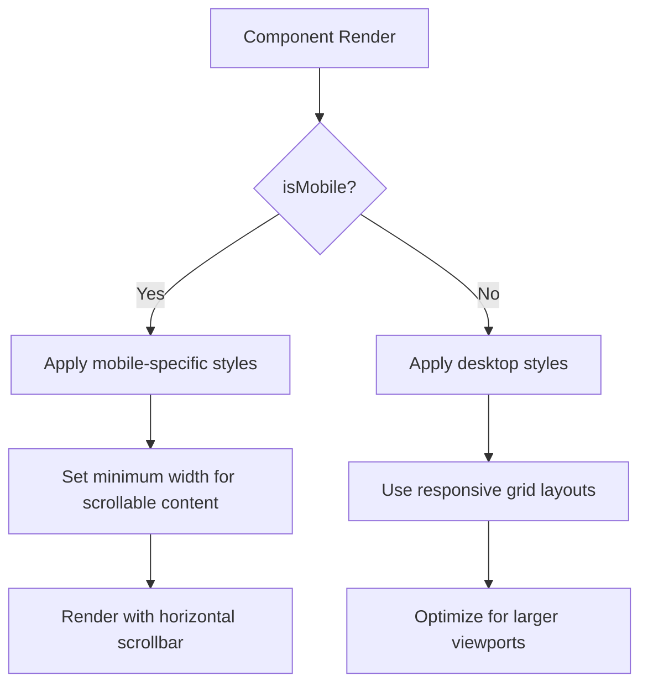

**Diagram sources**  
- [card-table.tsx](file://src/components/card-table/card-table.tsx#L32-L139)
- [profile-dropdown.tsx](file://src/components/admin/layout/profile-dropdown.tsx#L22-L70)

### Accessibility Compliance
All components follow WCAG standards with proper ARIA attributes, keyboard navigation support, focus management, and semantic HTML structure. The components include features such as:
- Proper focus trapping in modals
- Accessible labels and descriptions
- Keyboard navigation for interactive elements
- Screen reader support through ARIA attributes
- Color contrast compliance
- Reduced motion preferences

**Section sources**  
- [button.tsx](file://src/components/ui/button.tsx#L1-L59)
- [app-modal.tsx](file://src/components/common/app-modal.tsx#L1-L116)
- [table.tsx](file://src/components/ui/table.tsx#L1-L113)

## Styling and Theming System

### Tailwind CSS Implementation
The styling system is built on Tailwind CSS with custom configurations and utility classes. The globals.css file defines custom properties and theme variables that are used throughout the component library.

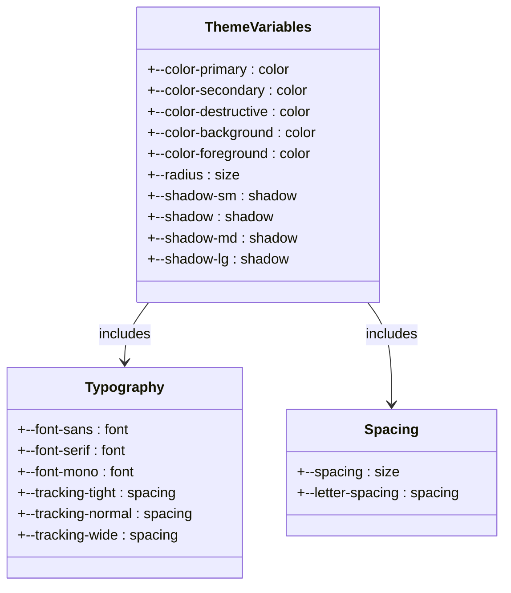

**Diagram sources**  
- [globals.css](file://src/app/globals.css#L1-L189)

**Section sources**  
- [globals.css](file://src/app/globals.css#L1-L189)

### CSS Variables and Theming
The application supports theming through CSS variables that can be customized for different branding requirements. The theme variables are defined in the globals.css file and consumed by components through Tailwind's theme system.

**Section sources**  
- [globals.css](file://src/app/globals.css#L1-L189)

## Performance and Cross-Browser Compatibility

### Rendering Optimization
The components are optimized for performance with techniques such as:
- Virtualized rendering for large datasets
- Memoization of expensive computations
- Efficient event handling
- Lazy loading of non-critical components
- Optimized re-renders through React.memo and useMemo

### Cross-Browser Support
The component library supports modern browsers with fallbacks for older versions. The build process includes necessary polyfills and transpilation to ensure compatibility across different environments.

**Section sources**  
- [card-table.tsx](file://src/components/card-table/card-table.tsx#L1-L142)
- [app-modal.tsx](file://src/components/common/app-modal.tsx#L1-L116)

## Component Usage Examples

### Modal Usage Pattern
The AppModal component is used consistently across the application for data entry and confirmation dialogs, integrating with React Query for data mutations.

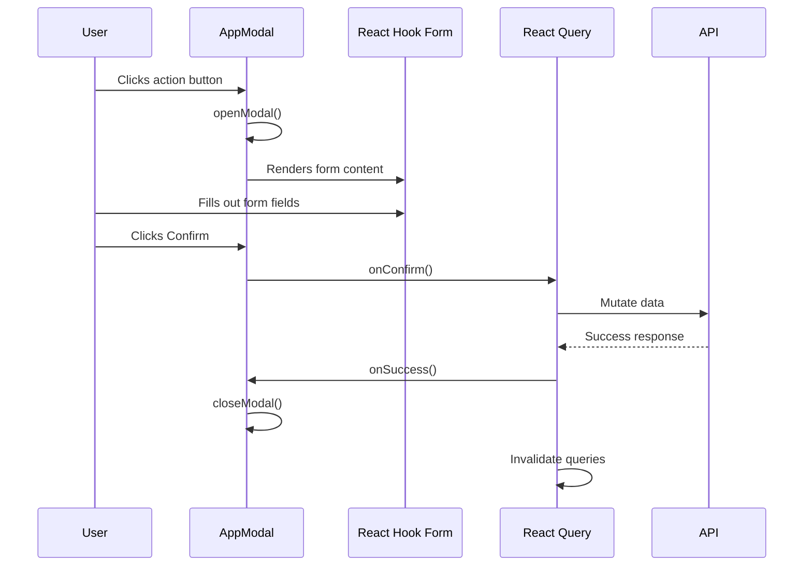

**Diagram sources**  
- [app-modal.tsx](file://src/components/common/app-modal.tsx#L36-L105)
- [executive-member-form.tsx](file://src/components/executive-members/executive-member-form.tsx#L138-L176)

### Table Integration Pattern
The CardTable component is integrated with React Query to display data from API endpoints with sorting, pagination, and filtering capabilities.

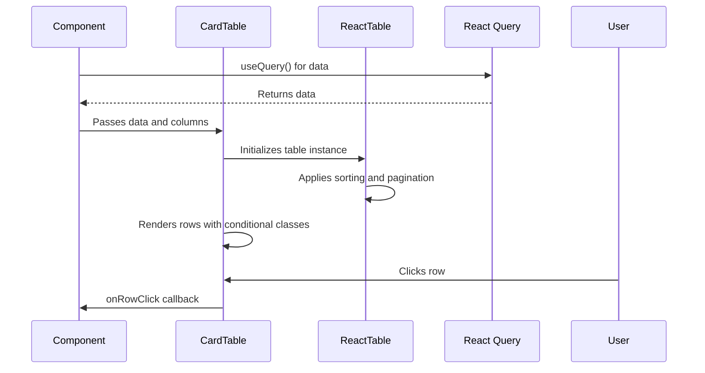

**Diagram sources**  
- [card-table.tsx](file://src/components/card-table/card-table.tsx#L32-L139)
- [use-employees.ts](file://src/hooks/queries/use-employees.ts#L1-L44)

## Conclusion
The UI component library in the CartwrightKing Admin ERP application provides a robust, consistent, and accessible foundation for building administrative interfaces. By leveraging shadcn/ui primitives, Tailwind CSS, and modern React patterns, the library ensures a high-quality user experience across all modules. The components are designed with reusability, accessibility, and performance in mind, following industry best practices for enterprise applications. The integration with React Hook Form and React Query provides a seamless developer experience for form handling and data management, while the theming system allows for easy customization and branding.